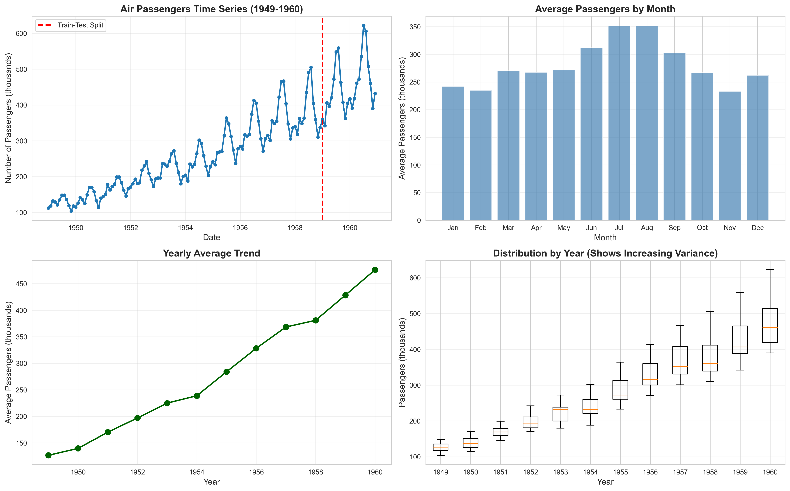
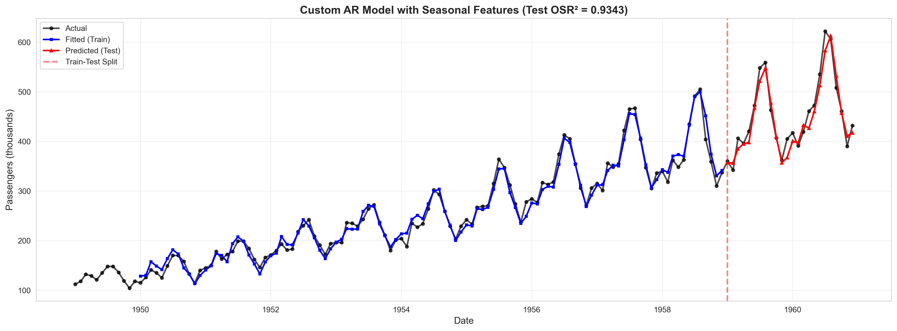
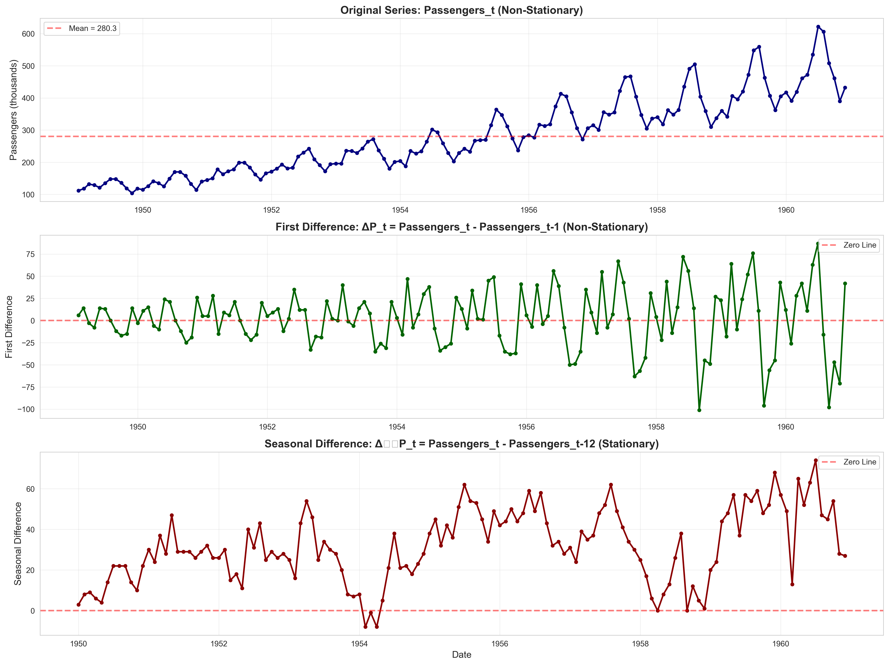

# Air Passengers Time Series Analysis

A comprehensive time series forecasting project analyzing international airline passenger data from 1949-1960. This project explores various modeling techniques including linear regression, auto-regressive models, and ensemble methods to predict passenger volumes.

## 📊 Project Overview

This analysis examines the classic Air Passengers dataset to demonstrate:
- Time series decomposition (trend, seasonality, stationarity)
- Feature engineering for temporal data
- Model comparison and evaluation
- Stationarity testing using the Augmented Dickey-Fuller test

## 🎯 Key Results

| Model | Test R² | Performance |
|-------|---------|-------------|
| Custom AR Model | **0.9343** | ✅ Best - captures trend, seasonality, and autocorrelation |
| Random Forest | 0.6239 | ⚠️ Good but overfits with limited data |
| Linear Trend | -0.0030 | ❌ Misses seasonal patterns |
| AR(1) | -3.6192 | ❌ Fails on non-stationary data |

## 📁 Repository Structure

```
.
├── AirPassengers.csv           # Dataset
├── analysis.py                 # Main analysis script
├── requirements.txt            # Python dependencies
├── outputs/                    # Generated visualizations and results
│   ├── part_a_visualization.png
│   ├── part_b_models.png
│   ├── part_c_custom_model.png
│   ├── part_d_rf_comparison.png
│   ├── part_e_stationarity.png
│   └── part_e_ar1_diff12.png
└── README.md
```

## 🚀 Getting Started

### Prerequisites

```bash
Python 3.8+
```

### Installation

1. Clone the repository:
```bash
git clone https://github.com/yourusername/air-passengers-analysis.git
cd air-passengers-analysis
```

2. Install required packages:
```bash
pip install -r requirements.txt
```

### Running the Analysis

```bash
python analysis.py
```

The script will:
- Generate all visualizations in the `outputs/` directory
- Print detailed analysis results to the console
- Create comparison charts for all models

## 📈 Analysis Components

### 1. Exploratory Data Analysis
- Visualizes time series patterns
- Identifies trend and seasonality
- Analyzes variance over time
- Monthly and yearly aggregations

### 2. Baseline Models
- **Linear Trend Model**: Captures long-term growth
- **AR(1) Model**: Simple autoregressive approach

### 3. Advanced Feature Engineering
- Temporal features (time period)
- Seasonal indicators (month dummies)
- Autoregressive features (Lag-1, Lag-12)
- Statistical feature selection (p-value < 0.05)

### 4. Model Comparison
- Custom Linear AR Model with selected features
- Random Forest with time series cross-validation
- Performance metrics: R² and Out-of-Sample R² (OSR²)

### 5. Stationarity Analysis
- Augmented Dickey-Fuller (ADF) test
- First differencing
- Seasonal differencing (12-month lag)
- AR(1) modeling on stationary series

## 🔍 Key Insights

1. **Seasonality is Crucial**: The 12-month lag feature (Lag_12) is essential for capturing year-over-year patterns

2. **Feature Engineering > Model Complexity**: A well-engineered linear model (OSR² = 0.934) outperforms Random Forest (OSR² = 0.624)

3. **Stationarity Matters**: 
   - Original series: Non-stationary (ADF p-value = 0.99)
   - Seasonal differencing achieves stationarity (ADF p-value = 0.01)

4. **Trend + Seasonality + Autocorrelation**: The best model explicitly captures all three components

## 📊 Visualizations

### Time Series Exploration

*Trend, seasonality, and variance analysis*

### Model Performance

*Best performing model with Test OSR² = 0.9343*

### Stationarity Testing

*ADF test results for different transformations*

## 🛠️ Technologies Used

- **Python 3.9+**
- **pandas**: Data manipulation
- **numpy**: Numerical computations
- **scikit-learn**: Machine learning models
- **statsmodels**: Time series analysis and ADF test
- **matplotlib & seaborn**: Visualizations

## 📚 Dataset

The Air Passengers dataset contains monthly totals of international airline passengers from January 1949 to December 1960 (144 observations).

**Features:**
- `Month`: Date (YYYY-MM format)
- `#Passengers`: Number of passengers (in thousands)

**Source**: Classic time series dataset, originally from Box & Jenkins (1976)

## 🎓 Methodology

### Train-Test Split
- Training: 120 months (1949-01 to 1958-12)
- Testing: 24 months (1959-01 to 1960-12)
- Evaluation: Out-of-Sample R² (OSR²)

### Feature Selection
Features retained based on statistical significance (p-value < 0.05):
- `Lag_1`: Previous month's passengers
- `Lag_12`: Same month from previous year
- `Month_3`, `Month_6`, `Month_7`: Spring/summer months
- `Month_9`, `Month_10`, `Month_11`: Fall months

### Cross-Validation
Time Series Split (5 folds) used for Random Forest hyperparameter tuning

## 📝 Model Equations

### Best Model: Custom AR Linear
```
Passengers_t = 11.15
    + 0.4906 × Lag_1
    + 0.5301 × Lag_12
    + 14.36 × Month_3
    + 19.56 × Month_6
    + 18.74 × Month_7
    - 21.78 × Month_9
    - 19.01 × Month_10
    - 18.42 × Month_11
```

## 🤝 Contributing

Contributions are welcome! Feel free to:
- Open issues for bugs or suggestions
- Submit pull requests with improvements
- Share your own analyses or extensions

## 📄 License

This project is open source and available under the MIT License.

## 👤 Author

Your Name
- GitHub: [@yourusername](https://github.com/yourusername)
- LinkedIn: [Your Profile](https://linkedin.com/in/yourprofile)

## 🙏 Acknowledgments

- Dataset: Box, G. E. P., & Jenkins, G. M. (1976). Time Series Analysis: Forecasting and Control
- Inspired by classic time series analysis techniques
- Built with open-source tools and libraries

---

**Note**: This analysis demonstrates fundamental time series forecasting concepts and serves as a reference for similar temporal prediction tasks.
